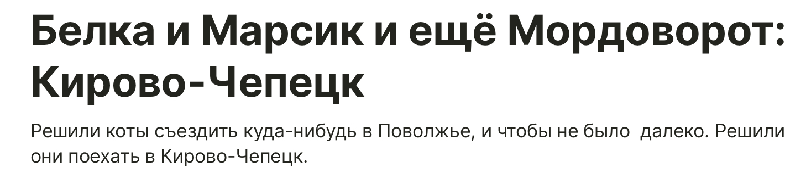

## Белка и Марсик и еще Мордоворот

Привет! Молодец что зашел к нам на сайт, тут много интересного!

### Новая история

### Обо мне

Привет! Я [Егор](https://egoronline.github.io), я пишу истории с котятами. Эти котята не выдуманные персонажи - они действительно существуют. 

Я буду очень рад, если вы [подпишитесь на истории в Teletype](https://teletype.in/@marusia_marsik)

### Способы связи

Эл. почта: <belka.marsik@yandex.ru>

Telegram: [@egor4423](https://t.me/egor4423)

<!-- Yandex.Metrika informer -->

<!-- /Yandex.Metrika informer -->

<!-- Yandex.Metrika counter -->

<noscript>

</noscript>
<!-- /Yandex.Metrika counter -->
